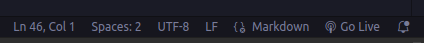

# AgileContent 


<br />
<br />

## API

```
  Get Movie

  https://ap-cine.onrender.com/movie
```

```
 Get Episodes

 https://ap-cine.onrender.com/episodes
```

<br/>
<br/>


## Application Deploy

```
   https://shermondevelopment.github.io/
```

<br />
<br />

## How to Run

### Install live serve vscode extension


## Then click Go Live at the bottom of vscode




then the application will open in the browser

http://localhost:5500